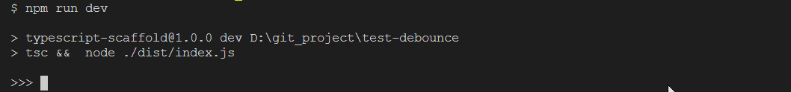

Debounce || 函数防抖
=

函数防抖，用一个命令行cli演示，输入过快回车也只会最后调用一次处理逻辑。 :white_check_mark:

**原理；** 用闭包存储上一个计时器id，然后子函数先清除该id，再设置新id。

**本质：** 闭包作用和简单的类一样，存储功能如同私有成员变量。

具体实现在src/lib里。

演示
--



运行
--

```sh
npm run dev
```

具体实现
--

定义工厂函数
```ts
const debounce = (fn: () => any, timeout: number) => {
  let timmer: any;
  return () => {
    timmer ? clearTimeout(timmer) : null
    timmer = setTimeout(fn, timeout);
  }
}
```

生成防抖函数，配置处理逻辑和延时

```ts
const debouncer = debounce(() => console.log('debounce'), 2000)
```

调用防抖函数

```ts
debouncer()
```

References
--

1. [闭包 - JavaScript | MDN](https://developer.mozilla.org/zh-CN/docs/Web/JavaScript/Closures)
2. [函数防抖与函数节流 - 前端 - 掘金](https://juejin.im/entry/5b2b3f6ee51d4558df36fb93)